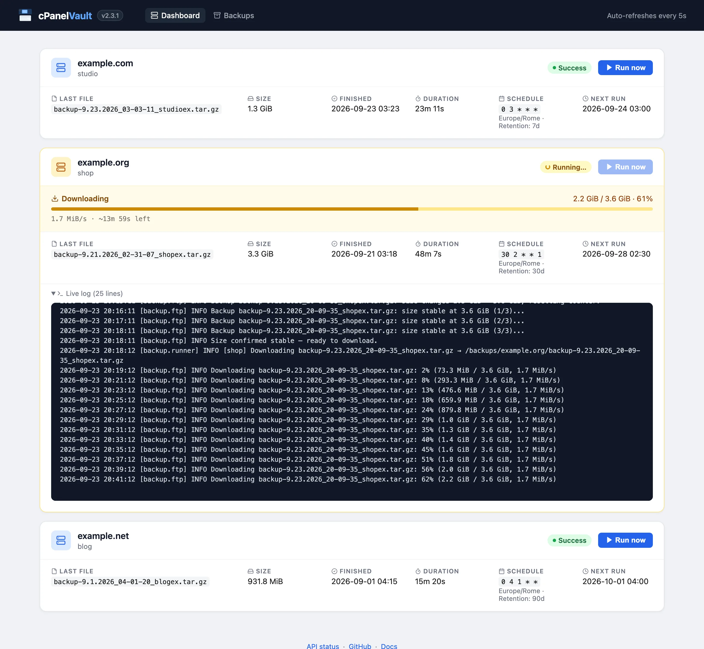

# cPanelVault

Strumento per il backup automatico di hosting condivisi basati su cPanel. Richiede il backup completo tramite API cPanel, lo scarica via FTP con resume automatico, lo archivia in locale e rimuove il file remoto al termine.

> **README in English (default):** [README.md](README.md) · **Sito:** [cpanelvault.gioxx.org](https://cpanelvault.gioxx.org)



## Caratteristiche

- Backup completo (`fullbackup_to_homedir`) via API cPanel UAPI, con nuovi tentativi automatici in caso di problemi di connessione
- Download FTP con resume automatico, timeout sui socket e controllo dello spazio libero su disco prima di ogni download
- Attesa intelligente: polling finché la dimensione del file si stabilizza
- I backup già presenti sul server FTP vengono scaricati per primi, poi ne viene richiesto uno nuovo
- Pulizia automatica dei backup locali scaduti (retention configurabile per host)
- **Multi-host**: ogni hosting ha la propria configurazione e cron schedule indipendente
- **Concorrenza sicura**: un lock interprocesso per account impedisce a CLI, scheduler e web UI di fare due backup contemporanei dello stesso account cPanel
- **Web UI**: dashboard con fase corrente, avanzamento del download (velocità/ETA) e log in tempo reale, più una pagina **Backups** con gli archivi locali, retention, scadenze e spazio su disco
- **CLI**: backup, pulizia e avvio server da riga di comando
- **Notifiche**: Telegram, SMTP e Resend — configurabili dal file JSON
- **Docker-ready**: immagini ufficiali multi-arch su Docker Hub e GHCR; `docker compose up` e sei operativo

## Struttura del progetto

```
backup/
  config.py     — dataclass HostConfig, caricamento ftp_config.json
  cpanel.py     — richiesta backup via API cPanel (con nuovi tentativi)
  ftp.py        — connessione, polling, download con resume, controllo spazio, cancellazione remota
  cleaner.py    — pulizia backup locali scaduti
  inventory.py  — inventario archivi locali e spazio sul volume (pagina Backups)
  lock.py       — lock interprocesso per account
  runner.py     — orchestrazione completa per un host; scrive status.json
  notify.py     — notifiche Telegram / SMTP / Resend
web/
  app.py        — FastAPI: dashboard, pagina Backups, trigger manuale, APScheduler, API REST
  templates/
    base.html     — layout comune, stili, auto-refresh
    index.html    — dashboard: card host, fase/avanzamento/log live
    backups.html  — pagina Backups: archivi, retention, scadenze
    _icons.html   — macro icone SVG
main.py         — entry point CLI
Dockerfile
docker-compose.yml
ftp_config_sample.json
```

## Configurazione

Copia `ftp_config_sample.json` in `ftp_config.json` e inserisci i tuoi dati. Il file non è incluso nel repo (`.gitignore`).

```json
{
    "notifications": { ... },
    "cpanel1": {
        "host": "dominio.com",
        "backup_local_dest_folder": "/backups",
        "cpanel_api_token": "IL_TUO_TOKEN",
        "cpanel_username": "admin",
        "ftp_password": "la_tua_password",
        "ftp_username": "backup@dominio.com",
        "mail_to_notify": "tu@dominio.com",
        "time_to_wait": 60,
        "retention_days": 30,
        "schedule": "0 2 * * *"
    }
}
```

### Riferimento campi host

| Campo | Tipo | Default | Descrizione |
|---|---|---|---|
| `host` | string | — | Hostname FTP (con o senza `ftp.`) |
| `ftp_username` | string | — | Username FTP |
| `ftp_password` | string | — | Password FTP |
| `cpanel_username` | string | — | Username cPanel |
| `cpanel_api_token` | string | — | API token cPanel (vedi sotto) |
| `backup_local_dest_folder` | string | — | Cartella radice per i backup locali (`/backups` in Docker) |
| `mail_to_notify` | string | — | Email che cPanel usa per notificare il completamento del backup |
| `time_to_wait` | int | `60` | Secondi tra un controllo e l'altro durante la generazione del backup |
| `retention_days` | int | `30` | Giorni di retention dei backup locali |
| `schedule` | string | — | Cron expression per lo scheduler automatico (timezone via `TZ`); ometti per solo manuale. I numeri standard sono supportati (0 e 7 = domenica, 1 = lunedì … 6 = sabato) |
| `request_after_download` | bool | `true` | Se sul server FTP è già presente un backup precedente e viene scaricato, richiede automaticamente un nuovo backup tramite API cPanel al termine. Evita buchi nella storia dei backup se il cron gira mentre un file vecchio è ancora sul server |

La chiave di primo livello (`cpanel1`, `website`, ecc.) è il nome usabile da CLI e nell'URL della web UI.

I backup vengono salvati in `backup_local_dest_folder/<hostname>/backup-*.tar.gz`.

### Variabili d'ambiente

| Variabile | Default | Descrizione |
|---|---|---|
| `CONFIG_FILE` | `ftp_config.json` (`/app/ftp_config.json` in Docker) | File di configurazione usato da web UI e scheduler. La CLI usa invece `--config` |
| `STATUS_FILE` | `status.json` (`/data/status.json` in Docker) | Stato dell'ultima esecuzione di ogni host, letto dalla dashboard |
| `LOCK_DIR` | `locks/` accanto a `STATUS_FILE` | File di lock che impediscono backup concorrenti dello stesso account |
| `TZ` | `UTC` | Timezone delle cron schedule e degli orari mostrati nella web UI |
| `QUIET_ACCESS_LOG` | `true` | Imposta `false` per loggare ogni richiesta HTTP, compresi auto-refresh della dashboard e healthcheck |

### Generare un API token cPanel

1. Accedi a cPanel → **Manage API Tokens**
2. Crea un nuovo token con nome descrittivo (es. `backup-script`)
3. Incolla il valore nel campo `cpanel_api_token`

## Notifiche

Tutti i canali di notifica si configurano nella sezione `notifications` del `ftp_config.json`. Puoi abilitarne più di uno contemporaneamente — la notifica viene inviata a tutti quelli con `"enabled": true`.

### Telegram

Crea un bot con [@BotFather](https://t.me/BotFather) per ottenere il token. Per il `chat_id` usa [@userinfobot](https://t.me/userinfobot) o l'ID del canale/gruppo (prefisso `-100`).

```json
"notifications": {
    "telegram": {
        "enabled": true,
        "bot_token": "123456789:AABBcc...",
        "chat_id": "-100123456789"
    }
}
```

### SMTP

Funziona con qualsiasi server SMTP. Per Gmail usa una [App Password](https://myaccount.google.com/apppasswords) con `port: 587` e `use_ssl: false` (STARTTLS). Per SSL nativo usa `port: 465` e `use_ssl: true`.

```json
"smtp": {
    "enabled": true,
    "host": "smtp.gmail.com",
    "port": 587,
    "use_ssl": false,
    "username": "tu@gmail.com",
    "password": "app-password",
    "from": "cPanelVault <tu@gmail.com>",
    "to": "destinatario@dominio.com"
}
```

### Resend

Alternativa SMTP cloud. Registrati su [resend.com](https://resend.com), verifica il dominio mittente e crea un API key.

```json
"resend": {
    "enabled": true,
    "api_key": "re_xxxx...",
    "from": "cPanelVault <backup@tuodominio.com>",
    "to": "destinatario@dominio.com"
}
```

## Utilizzo

### Docker (consigliato)

A ogni release vengono pubblicate immagini ufficiali multi-arch (`linux/amd64`, `linux/arm64`):

| Registry | Immagine |
| --- | --- |
| Docker Hub | `gfsolone/cpanelvault` |
| GitHub Container Registry | `ghcr.io/gioxx/cpanelvault` |

Tag: `latest` (ultima release), `X.Y.Z` (una release specifica), `dev` (`main` corrente, non rilasciato).

```bash
cp ftp_config_sample.json ftp_config.json
# modifica ftp_config.json con le tue credenziali
docker compose up -d
```

La web UI è disponibile su `http://localhost:8080`. Il `docker-compose.yml` incluso usa `gfsolone/cpanelvault:latest`; per fare la build dai sorgenti, sostituisci `image:` con `build: .`.

I backup finiscono nel volume Docker `backups`. Per salvarli su un path fisso, modifica `docker-compose.yml`:

```yaml
volumes:
  - ./ftp_config.json:/app/ftp_config.json:ro
  - /mnt/disco_esterno:/backups        # path locale
  - data:/data
```

### Portainer

Con Portainer non hai una cartella di progetto locale, quindi il file di configurazione va creato manualmente sull'host Docker prima di fare il deploy dello stack.

**Step 1 — crea il file di configurazione sull'host** (SSH sulla macchina che esegue Docker):

```bash
mkdir -p /opt/cpanelvault
cp /path/to/ftp_config_sample.json /opt/cpanelvault/ftp_config.json
nano /opt/cpanelvault/ftp_config.json   # inserisci le tue credenziali
```

**Step 2 — crea un nuovo stack in Portainer** (Stacks → Add stack → Web editor) e incolla:

```yaml
services:
  cpanelvault:
    image: gfsolone/cpanelvault:latest
    ports:
      - "8080:8080"
    volumes:
      - /opt/cpanelvault/ftp_config.json:/app/ftp_config.json:ro
      - cpanelvault_backups:/backups
      - cpanelvault_data:/data
    environment:
      STATUS_FILE: /data/status.json
      CONFIG_FILE: /app/ftp_config.json
      TZ: Europe/Rome   # la tua timezone, usata dalle cron schedule
    restart: unless-stopped

volumes:
  cpanelvault_backups:
  cpanelvault_data:
```

I named volume (`cpanelvault_backups`, `cpanelvault_data`) vengono creati automaticamente e sono visibili in Portainer sotto **Volumes**. Se vuoi i backup su un path specifico dell'host, sostituisci il named volume con un bind mount:

```yaml
    volumes:
      - /opt/cpanelvault/ftp_config.json:/app/ftp_config.json:ro
      - /mnt/disco_esterno:/backups
      - cpanelvault_data:/data
```

Per aggiornare a una nuova release: **Stacks → cpanelvault → Update the stack**, con **Re-pull image** attivo. Se preferisci aggiornare manualmente, fissa un tag specifico (es. `gfsolone/cpanelvault:2.3.1`) al posto di `latest`.

### Locale

```bash
pip install -r requirements.txt
cp ftp_config_sample.json ftp_config.json
# modifica ftp_config.json

# Web UI + scheduler automatico
python main.py serve

# Backup manuale di un singolo host
python main.py backup cpanel1

# Backup di tutti gli host in sequenza
python main.py backup --all

# Anteprima pulizia backup scaduti (senza cancellare)
python main.py clean cpanel1 --dry-run

# Pulizia effettiva di tutti gli host
python main.py clean --all
```

### API REST

Quando la web UI è in esecuzione:

| Metodo | Path | Descrizione |
|---|---|---|
| `GET` | `/` | Dashboard HTML |
| `GET` | `/api/status` | Stato JSON di tutti gli host |
| `GET` | `/api/hosts` | Lista host configurati |
| `GET` | `/backups` | Pagina archivi locali: spazio del volume, retention, scadenze e date di rimozione |
| `GET` | `/api/backups` | Stessi dati in JSON |
| `POST` | `/backup/<nome>` | Avvia backup in background |

```bash
# Trigger da script bash
curl -X POST http://localhost:8080/backup/cpanel1

# Stato in JSON
curl http://localhost:8080/api/status
```

## Note

- Il file di backup viene cancellato dal server FTP solo dopo che il download locale è andato a buon fine.
- Se sul server FTP è rimasto un backup di una sessione precedente, viene prima scaricato (e rimosso dal server). Con `request_after_download: true` (il default) subito dopo ne viene richiesto uno nuovo, così il run programmato produce comunque un archivio aggiornato.
- Le cron schedule e gli orari mostrati nella web UI usano la timezone impostata con `TZ` (default UTC).
- Per ogni account cPanel può girare un solo backup alla volta. Il lock si basa sull'host FTP (ignorando maiuscole, prefisso `ftp.` e punto finale) più `cpanel_username`, quindi anche voci diverse della configurazione che puntano allo stesso account vengono serializzate; un secondo run per un account occupato viene saltato con un warning nel log (nessuna notifica, stato invariato; la CLI esce con codice 1). La CLI condivide il lock con la web UI solo se entrambe usano la stessa `LOCK_DIR`, ad esempio `docker compose exec cpanelvault python main.py backup cpanel1`. Nella dashboard la voce effettivamente in esecuzione mostra **Running…**, le altre voci dello stesso account mostrano **Busy**.
- Un backup rimasto "running" per un processo terminato bruscamente (es. `docker compose down` durante il run) viene segnato come interrotto al riavvio successivo.
- I problemi temporanei vengono gestiti con nuovi tentativi: la richiesta di backup a cPanel dopo 10 e 30 minuti in caso di errori di connessione, i download FTP ogni 10 secondi (riprendendo da dove si erano fermati), la cancellazione remota fino a 5 volte. Se il volume di backup non ha spazio libero sufficiente, il download viene interrotto subito.
- I log vanno su stdout; con Docker usa `docker compose logs -f`.
- Durante un backup la dashboard mostra la fase corrente (verifica FTP, attesa cPanel, controllo di stabilità, download, retention), l'avanzamento del download e un log live espandibile; a fine run il pannello conserva il log dell'ultima esecuzione. La pagina si aggiorna ogni 5s mentre un backup è in corso, ogni 30s altrimenti.
- La pagina **Backups** elenca per host gli archivi presenti sul volume di backup, con dimensione, data cPanel, data di download, scadenza (data di download + `retention_days`) e il run programmato che li rimuoverà. La pulizia avviene al termine di un backup, solo dopo che il nuovo archivio è stato scaricato (un run che fallisce prima non cancella nulla), quindi un archivio scaduto resta fino al run successivo.
- Le richieste `GET /`, `GET /api/status` e `GET /static/*` andate a buon fine (auto-refresh della dashboard, healthcheck Docker) non vengono scritte nell'access log. Imposta `QUIET_ACCESS_LOG=false` per loggare ogni richiesta.
